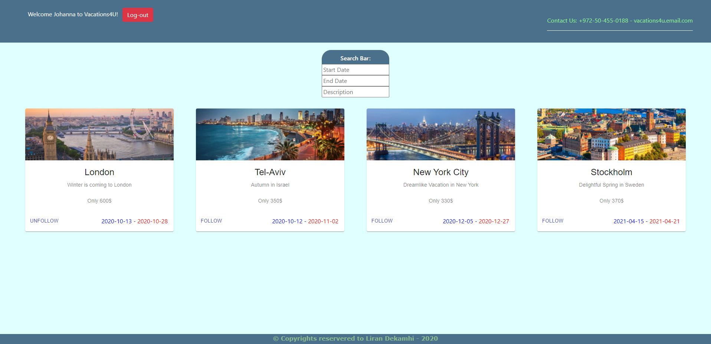
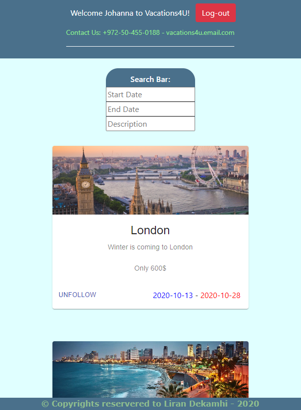
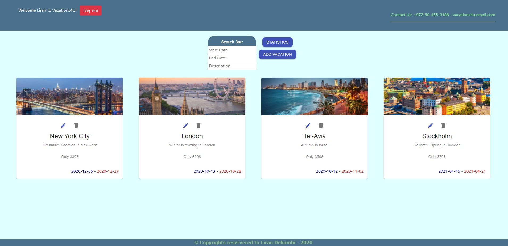
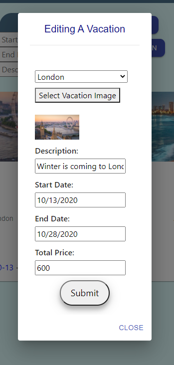
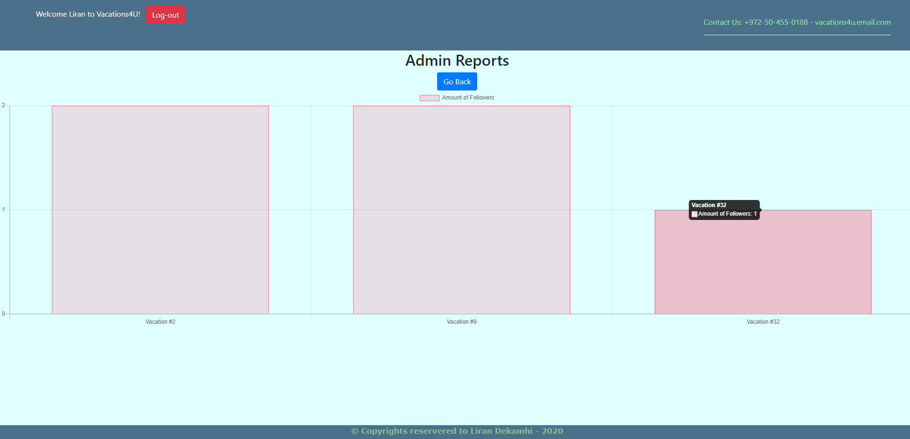

# Vacations_Site

Vacation Follow-Up system with real time updates on any change using Sockets.IO

## Topics:

* HTML + CSS
  - HTML5 Structure
  - Bootstrap design
* React
  - Redux
  - React -saga / thunk / middleware
  - Container components / service component / router etc..
* NodeJS
  - Using express
  - Restfull App
* MySQL
  - Design & create schema
  - Queries

***

## Production URL

http://vacations-project-server.herokuapp.com/

* Log in as Admin:
  - Email: Liran , Password: 1234

***

### Main Page:

***

### Mobile Friendly:

***

### Admin Mode:

***

### Edit Panel:

* There's also an option to add a vacation

***

### Admin Graph:

***

### `Vacations Sorted by Followed / not Followed`

This sorting is only done once on retrieval of the vacations and in the server. I chose to do it this way
because I found it very uncomfortable to look at a real time sorting whenever I clicked to follow / unfollow a vacation.
Therefore I chose to only sort once, on each retrieval.

### `Sockets`

All connected clients will be notified when any of the following actions occur: "Adding a Vacation, Editing a Vacation, Deleting a Vacation".
And the data will be updated accordingly, regardless of the following status of the vacation (Followed / Unfollowed).
I found it wrong to present incorrect info simply because the user wasn't following that exact vacation. The information must always be up to date

### `Admin Restriction`

Admins can not follow or unfollow a vacation.
